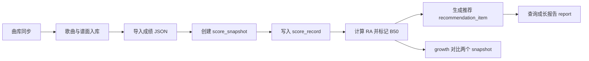

# maimaiDX 玩家成绩分析与练习推荐系统

## 1. 项目简介

maimaiDX 玩家成绩分析与练习推荐系统是一个基于 Spring Boot 的后端项目，用于围绕 maimaiDX 玩家成绩数据完成曲库同步、歌曲查询、成绩导入、B50 分析、规则驱动的练习推荐、成长报告和成长趋势对比。

当前版本聚焦后端核心业务闭环，重点实现“曲库数据 -> 成绩快照 -> B50 分析 -> 规则推荐 -> 报告查询 -> 快照对比”的最小可运行流程。成绩数据可以通过手动 JSON 导入，不强依赖真实查分接口。

## 2. 技术栈

- Java 17
- Spring Boot 3.2.5
- MyBatis-Plus 3.5.6
- MySQL
- RESTful API
- JSON 数据处理：Jackson、Fastjson2
- 事务管理：Spring `@Transactional`
- 统一异常处理：`@RestControllerAdvice`
- Swagger / OpenAPI：springdoc-openapi
- Maven Wrapper

## 3. 核心功能

### 曲库同步

后端提供默认曲库同步接口，可以从 `backend/src/main/resources/data/songs-mvp.json` 读取示例曲库数据并写入数据库。同步逻辑会保存歌曲、谱面、等级、定数、拟合难度、note 数等信息。

同时提供自定义 JSON 曲库同步接口，可以接收请求体中的曲库数据。歌曲与谱面采用“先查询再插入或更新”的方式处理。

### 歌曲查询

支持按歌曲名关键字、等级、定数范围、版本等条件查询曲库。接口返回歌曲基础信息以及对应谱面列表。

该功能用于验证曲库数据是否成功入库，也为成绩导入和推荐逻辑提供基础数据。

### 成绩导入

支持通过 JSON 手动导入玩家成绩。每次导入会创建一条独立的成绩快照 `score_snapshot`，并将具体成绩写入 `score_record`。

导入时会根据 `songId` 和 `difficulty` 匹配曲库中的谱面，再根据谱面定数和达成率计算 RA。

### B50 分析

导入成绩后，系统会在本次快照内按 RA 降序取前 50 条成绩，并标记为 B50。查询 B50 时返回成绩列表、B50 边缘 RA、等级分布和定数分布。

当前版本重点展示快照内成绩排序、RA 计算和分析指标生成，后续可继续扩展为更完整的历史成绩分析。

### 练习推荐生成

推荐接口会基于玩家 B50 边缘 RA、谱面定数、当前达成率等数据，通过明确的业务规则计算目标达成率、预期 RA 提升和推荐分数，生成可解释的练习谱面推荐。

推荐结果按推荐分数排序后取 Top 20，并写入 `recommendation_item` 表，便于后续查询和报告聚合。

### 推荐结果查询

推荐生成和推荐查询拆分为两个接口。`POST /player/{userId}/recommend` 用于重新生成并保存推荐结果，`GET /player/{userId}/recommendations` 用于查询已保存的推荐结果。

这种设计避免每次查询都重复计算，也让推荐结果可以独立保存和查询。

### 成长报告

成长报告接口聚合当前快照的 rating、B50 分析结果和推荐结果。它面向前端页面展示，便于一次性获取玩家当前成长状态。

报告数据来自真实导入的成绩快照和已生成推荐，不依赖页面假数据。

### 成长趋势对比

`growth` 接口用于对比同一玩家两次成绩快照。它会复用已有 B50 查询逻辑，返回 rating 变化、B50 边缘 RA 变化、新进入 B50 的谱面、掉出 B50 的谱面和 RA 提升的谱面。

### 统一异常处理

项目使用 `GlobalExceptionHandler` 统一处理参数校验异常、业务参数异常和未知异常。比如快照不存在时，接口会返回统一 `Result` JSON，而不是直接暴露 Spring Boot 500 错误页面。

## 4. 项目结构

后端核心目录位于 `backend/src/main/java/com/maimai/maidx`：

```text
com.maimai.maidx
├── config          # 全局配置，如跨域、Swagger、MyBatis-Plus、统一异常处理
├── controller      # REST API 入口，接收请求参数并返回 Result
├── dto             # 请求和响应 DTO，隔离接口数据结构与数据库实体
├── entity          # 数据库实体类，对应 MySQL 表
├── enums           # 枚举定义，如谱面难度、标签枚举
├── repository      # MyBatis-Plus Mapper，负责数据库访问
├── service         # 业务接口，定义核心业务能力
├── service/impl    # 业务实现，包含曲库同步、成绩导入、B50、推荐、growth 等逻辑
└── utils           # 通用工具类，如对象转换等
```

职责说明：

- Controller：暴露 HTTP 接口，负责参数接收和统一响应封装。
- Service：定义业务能力，隔离 Controller 与具体实现。
- Service Impl：实现核心业务流程，如快照创建、B50 标记、推荐生成。
- Repository：基于 MyBatis-Plus 操作数据库。
- Entity：描述数据库表字段。
- DTO：描述接口输入输出结构，避免直接暴露数据库实体。
- Config：提供 Swagger、MyBatis-Plus、异常处理等基础配置。

## 5. 数据库设计

MVP 闭环涉及的核心表：

- `song`：歌曲基础信息，如歌曲编号、标题、曲师、版本、分类、是否新曲。
- `song_difficulty`：谱面信息，如难度、等级、定数、拟合难度、note 数和谱师。
- `score_snapshot`：成绩快照，每次导入成绩生成一条记录。
- `score_record`：具体成绩记录，关联某次快照和某个谱面。
- `recommendation_item`：推荐结果，保存某次快照下生成的推荐曲目。

表关系：

- `song` 1:N `song_difficulty`
- `score_snapshot` 1:N `score_record`
- `song_difficulty` 1:N `score_record`
- `score_snapshot` 1:N `recommendation_item`
- `song_difficulty` 1:N `recommendation_item`

### snapshot 快照机制

每次成绩导入都会生成独立的 `score_snapshot`，并将本次导入的成绩写入对应的 `score_record`。系统不会用新成绩覆盖旧成绩，因此可以保留历史导入记录。

这个设计用于支撑两类能力：

- 查询某一次导入后的 B50 和推荐结果。
- 对比两次快照，分析 rating、B50 边缘 RA 和具体谱面的变化。

## 6. 核心接口清单

以下接口来自 `MvpController.java`。项目配置了统一 context-path：`/api`，所以本地完整路径需要加上 `/api` 前缀。

| 请求方法 | Controller 路径 | 本地完整路径示例 | 功能说明 | 是否写入数据库 |
| --- | --- | --- | --- | --- |
| GET | `/songs` | `/api/songs` | 查询曲库，支持关键字、等级、定数、版本筛选 | 否 |
| POST | `/songs/sync` | `/api/songs/sync` | 从默认本地 JSON 同步曲库 | 是 |
| POST | `/songs/sync/custom` | `/api/songs/sync/custom` | 从请求体 JSON 同步自定义曲库 | 是 |
| GET | `/charts/{songId}` | `/api/charts/mvp001` | 查询某首歌的谱面信息 | 否 |
| POST | `/player/import` | `/api/player/import?userId=999` | 导入玩家成绩 JSON，创建成绩快照 | 是 |
| GET | `/player/{userId}/b50` | `/api/player/999/b50?snapshotId=1` | 查询指定快照的 B50 分析 | 否 |
| POST | `/player/{userId}/recommend` | `/api/player/999/recommend?snapshotId=1` | 生成并保存练习推荐 | 是 |
| GET | `/player/{userId}/recommendations` | `/api/player/999/recommendations?snapshotId=1` | 查询已保存推荐结果 | 否 |
| GET | `/player/{userId}/growth` | `/api/player/999/growth?fromSnapshotId=1&toSnapshotId=2` | 对比两次成绩快照的成长趋势 | 否 |
| GET | `/player/{userId}/report` | `/api/player/999/report?snapshotId=1` | 查询成长报告，聚合 B50 和推荐结果 | 否 |

## 7. 核心业务流程



## 8. 重点设计说明

### 1. snapshot 快照机制

成绩导入不是简单覆盖当前成绩，而是为每次导入创建独立快照。这样可以保留历史数据，支持按快照查询 B50、推荐结果和成长报告。

这个设计也让 growth 对比可以复用已有快照数据，而不是额外维护一套历史变化表。

### 2. B50 分析

导入成绩时，系统会根据谱面定数 `ds` 和达成率 `achievement` 计算 RA。当前快照中的成绩按 RA 降序排序，前 50 条标记为 `is_b50 = 1`。

查询 B50 时，接口只读取指定快照下 `is_b50 = 1` 的记录，并计算 `edgeRa`、等级分布和定数分布。`edgeRa` 是推荐模块判断提分价值的重要参考。

### 3. 推荐模块为什么分 POST 生成和 GET 查询

推荐生成涉及候选谱面计算、推荐分数排序和数据库写入，因此使用 POST 接口。生成前会清理同一用户同一快照下的旧推荐，再写入新的推荐结果。

推荐查询只读取已保存的 `recommendation_item`，因此使用 GET 接口。这样可以避免每次打开页面都重新计算推荐。

### 4. growth 成长趋势对比

growth 接口接收 `fromSnapshotId` 和 `toSnapshotId`，分别调用已有 `getB50(userId, snapshotId)` 获取两次快照的 B50 结果。

随后使用 `songId + difficulty` 作为谱面唯一 key，比较得到：

- `newB50`：新快照进入 B50、旧快照不存在的谱面。
- `droppedB50`：旧快照在 B50、新快照不存在的谱面。
- `improvedScores`：两个快照都存在且新 RA 更高的谱面。

### 5. 统一异常处理

项目通过 `GlobalExceptionHandler` 统一处理异常。`IllegalArgumentException` 会返回 HTTP 400 和统一 `Result` 响应，未知异常会返回 HTTP 500 和固定错误信息。

例如查询不存在的快照时，接口返回：

```json
{
  "code": 400,
  "message": "未找到成绩快照，请先导入成绩 JSON",
  "data": null
}
```

## 9. 本地启动方式

### 环境要求

- JDK 17+
- MySQL 8.x 或兼容版本
- Windows PowerShell 或其他命令行环境
- 不需要全局安装 Maven，项目包含 Maven Wrapper

### 创建数据库

进入 MySQL 后执行：

```sql
CREATE DATABASE IF NOT EXISTS maimai_dx DEFAULT CHARACTER SET utf8mb4 COLLATE utf8mb4_unicode_ci;
USE maimai_dx;
```

然后执行项目中的 SQL 脚本。新数据库推荐顺序：

```sql
source D:/maimaiDX/database/init.sql;
source D:/maimaiDX/database/mvp_migration.sql;
```

如果需要导入示例基础数据，可根据脚本内容再执行：

```sql
source D:/maimaiDX/database/seed_data.sql;
```

### 配置本地环境变量

公开配置文件位于：

```text
backend/src/main/resources/application.yml
backend/src/main/resources/application-dev.yml
```

配置文件只保留环境变量占位符，不包含真实密码或密钥。启动前可在当前 PowerShell 会话中设置数据库连接信息：

```powershell
$env:DB_USERNAME = "<your-mysql-username>"
$env:DB_PASSWORD = "<your-mysql-password>"
```

数据库地址默认使用本机 `maimai_dx` 数据库。如需修改，可额外设置 `DB_URL`。其他本地密钥或第三方平台参数也应通过环境变量提供，不要提交到 Git。

### 启动后端

```powershell
cd D:\maimaiDX\backend
.\mvnw.cmd spring-boot:run
```

启动成功后，默认端口为 `8080`，后端 context-path 为 `/api`。

### 访问接口文档

项目已配置 springdoc-openapi，可访问：

```text
http://localhost:8080/api/swagger-ui/index.html
http://localhost:8080/api/swagger-ui.html
http://localhost:8080/api/v3/api-docs
```

### 构建验证

```powershell
cd D:\maimaiDX\backend
.\mvnw.cmd clean test
```

## 10. 接口测试示例

以下示例假设后端已启动，数据库已创建并完成必要迁移。

### 同步默认曲库

```powershell
Invoke-RestMethod -Method Post "http://localhost:8080/api/songs/sync"
```

### 查询歌曲

```powershell
Invoke-RestMethod -Method Get "http://localhost:8080/api/songs?page=1&size=5" |
  ConvertTo-Json -Depth 8
```

按关键字查询：

```powershell
Invoke-RestMethod -Method Get "http://localhost:8080/api/songs?keyword=Demo&page=1&size=5" |
  ConvertTo-Json -Depth 8
```

### 导入成绩 JSON

项目提供示例成绩文件：

```text
database/sample_score_import.json
```

PowerShell 示例：

```powershell
$body = Get-Content "D:\maimaiDX\database\sample_score_import.json" -Raw
Invoke-RestMethod -Method Post "http://localhost:8080/api/player/import?userId=999" `
  -ContentType "application/json" `
  -Body $body
```

### 查询 B50

将 `snapshotId` 替换为导入成绩接口返回的快照 ID：

```powershell
Invoke-RestMethod -Method Get "http://localhost:8080/api/player/999/b50?snapshotId=1" |
  ConvertTo-Json -Depth 8
```

### 生成推荐

```powershell
Invoke-RestMethod -Method Post "http://localhost:8080/api/player/999/recommend?snapshotId=1" |
  ConvertTo-Json -Depth 8
```

### 查询推荐结果

```powershell
Invoke-RestMethod -Method Get "http://localhost:8080/api/player/999/recommendations?snapshotId=1" |
  ConvertTo-Json -Depth 8
```

### 查询成长报告

```powershell
Invoke-RestMethod -Method Get "http://localhost:8080/api/player/999/report?snapshotId=1" |
  ConvertTo-Json -Depth 8
```

### 查询 growth 成长趋势

需要至少存在两个成绩快照：

```powershell
Invoke-RestMethod -Method Get "http://localhost:8080/api/player/999/growth?fromSnapshotId=1&toSnapshotId=2" |
  ConvertTo-Json -Depth 8
```

### 测试 snapshot 不存在时的统一异常返回

Windows PowerShell 在遇到 HTTP 400 时会进入 `catch`，可以这样读取响应体：

```powershell
try {
  Invoke-RestMethod -Method Get "http://localhost:8080/api/player/999/growth?fromSnapshotId=999&toSnapshotId=3"
} catch {
  $reader = New-Object System.IO.StreamReader($_.Exception.Response.GetResponseStream(), [System.Text.Encoding]::UTF8)
  $reader.ReadToEnd()
  $reader.Close()
}
```

预期返回格式：

```json
{
  "code": 400,
  "message": "未找到成绩快照，请先导入成绩 JSON",
  "data": null
}
```

## 11. 项目亮点

- 成绩快照 snapshot 机制：每次导入生成独立快照，保留历史成绩，支持快照对比分析。
- B50 分析与 edgeRa 计算：按 RA 标记 B50，并输出 B50 边缘 RA、等级分布和定数分布。
- 规则驱动的 Top 20 练习推荐：推荐结果包含目标达成率、预计提升值、推荐分数和推荐理由。
- growth 成长趋势对比：复用 B50 结果，对比两次快照中的 rating、edgeRa 和谱面变化。
- 统一异常处理与响应封装：通过 `Result` 和 `GlobalExceptionHandler` 统一成功与失败响应格式。

## 12. 后续优化方向

- growth 比较 key 从 `songId + difficulty` 优化为 `chartId` 或 `difficultyId`，避免曲目编号或难度映射变化带来的歧义。
- 优化 DTO 转换中的 N+1 查询，将循环内查询歌曲和谱面的逻辑改为批量查询后构建 Map。
- 补充参数校验，例如分页参数范围、导入 JSON 字段必填校验、快照 ID 合法性校验。
- 补充单元测试和集成测试，覆盖更多异常路径、推荐规则边界和数据库交互场景。
- 完善 Swagger/OpenAPI 接口文档，补充请求示例、响应示例和错误码说明。
