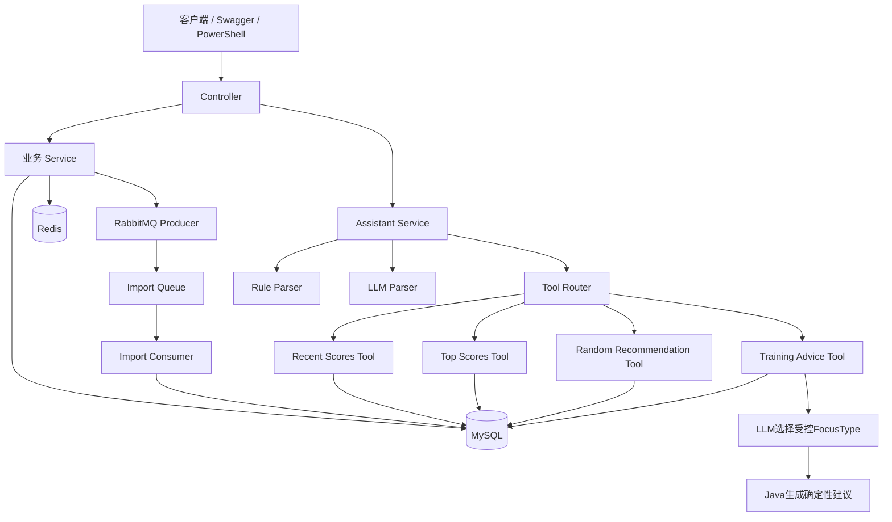
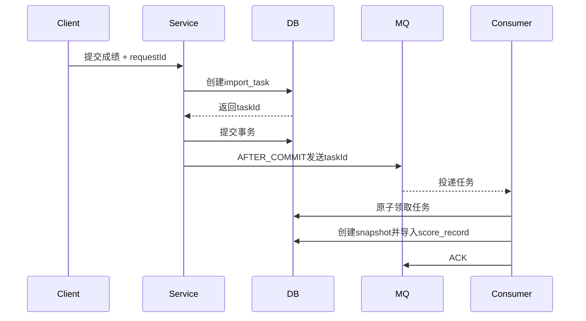

# maimaiDX 玩家成绩分析与 LLM 增强型练习助手

## 1. 项目简介

maimaiDX 玩家成绩分析与 LLM 增强型练习助手是一个基于 Spring Boot 的后端项目，围绕 maimaiDX 玩家成绩数据提供：

- 曲库管理与条件查询
- 历史成绩快照
- B50 分析
- 规则练习推荐
- 成长趋势对比
- Redis 曲目缓存
- RabbitMQ 异步成绩导入
- 自然语言成绩查询
- 基于真实成绩画像的训练方向推荐

项目最初从成绩管理与分析业务出发，在完成基础业务闭环后，进一步加入缓存、消息队列、数据库索引优化以及 LLM 能力。

当前项目采用模块化单体架构。

在 AI 模块中，LLM 不直接访问数据库，也不负责自由生成具体歌曲、定数、达成率或 RA 等事实数据。模型只根据 Java 后端计算出的聚合成绩画像选择受控训练方向，最终建议文本与成绩 evidence 由后端确定性生成，以降低模型幻觉和事实错配风险。

---

## 2. 技术栈

### 后端

- Java 17
- Spring Boot 3.2.5
- Spring MVC
- Spring Validation
- Spring Transaction
- MyBatis-Plus 3.5.6
- Maven Wrapper

### 数据与中间件

- MySQL 8.x
- Redis
- RabbitMQ
- Jackson
- Fastjson2

### AI

- OpenAI Compatible Chat Completions 协议
- LLM 意图识别
- Tool Router
- 受控训练方向选择
- JSON 结构校验
- RULE / LLM 双路径降级

### 工程能力

- RESTful API
- Swagger / OpenAPI
- 统一响应封装
- 全局异常处理
- 数据库唯一约束
- 消息可靠投递
- 手动 ACK
- 死信队列
- 自动化测试
- SQL EXPLAIN 优化
- 本地性能验证

---

# 3. 系统架构



整体设计原则：

```text
自然语言理解 → LLM / Rule

业务查询与计算 → Java Tool

真实事实 → MySQL

训练方向选择 → LLM

最终事实文本与 evidence → Java
```

---

# 4. 核心功能

## 4.1 曲库同步与查询

支持从：

```text
backend/src/main/resources/data/songs-mvp.json
```

加载示例曲库，并将歌曲与谱面写入数据库。

同时支持通过 JSON 请求体同步自定义曲库。

曲库保存的信息包括：

- songId
- 歌曲名称
- 曲师
- 版本
- 谱面难度
- 等级
- 定数
- 拟合难度
- note 数
- 谱师等

查询支持：

- 歌曲名关键字
- 等级
- 定数区间
- 版本
- 分页

---

## 4.2 成绩快照

每次成绩导入都会创建独立的：

```text
score_snapshot
```

具体成绩写入：

```text
score_record
```

结构：

```text
score_snapshot
└── score_record
    ├── 成绩1
    ├── 成绩2
    ├── ...
    └── 成绩N
```

系统不会使用新成绩覆盖旧成绩，因此可以保留不同时间点的历史数据。

快照机制主要用于：

- 查询指定导入批次的成绩
- 计算指定快照的 B50
- 保存快照对应的推荐结果
- 对比两次快照
- 分析 Rating 和 B50 变化

---

## 4.3 B50 分析

成绩导入后，系统根据：

```text
谱面定数
+
achievement
```

计算对应 RA。

随后按照 RA 排序生成 B50。

查询结果包含：

- B50 成绩列表
- Rating
- B50 边缘 RA
- 难度分布
- 定数分布

B50 边缘 RA 也会参与后续练习推荐和训练画像计算。

---

## 4.4 规则练习推荐

项目保留了一套不依赖 LLM 的规则推荐系统。

推荐逻辑综合考虑：

- B50 边缘 RA
- 谱面定数
- 当前达成率
- 目标达成率
- 预计 RA 提升
- 拟合难度

系统计算推荐分数后，选取候选谱面，并保存至：

```text
recommendation_item
```

推荐生成与查询拆分为：

```text
POST → 重新计算并保存

GET → 查询已经生成的结果
```

避免每次查看推荐时重复执行完整计算。

---

# 5. Redis 缓存

项目使用 Redis 缓存部分高频曲库查询。

主要缓存包括：

```text
songDetail
songCharts
```

例如：

```text
maidx:songCharts::mvp001
```

默认 TTL：

```text
21600 秒
= 6 小时
```

查询流程：

```text
请求
→ Redis
→ 命中：直接返回
→ 未命中：查询MySQL
→ 写入Redis
→ 返回
```

曲库同步后会主动清理相关缓存，避免继续读取旧曲库数据。

---

## Redis 故障降级

缓存不是核心数据源。

当 Redis 不可用时：

```text
Redis读取失败
→ CacheErrorHandler处理缓存异常
→ 回退MySQL
→ 返回业务结果
```

因此 Redis 故障不会直接导致曲库查询不可用。

MySQL 本身发生错误时仍正常向上抛出，不会被缓存异常处理逻辑吞掉。

---

# 6. RabbitMQ 异步成绩导入

除原有同步导入接口外，项目新增了 RabbitMQ 异步成绩导入能力。

两套接口当前并行存在：

```text
POST /api/player/import
→ 同步导入

POST /api/player/import/async
→ RabbitMQ异步导入
```

异步导入主要用于将较重的成绩处理过程从 HTTP 请求线程中拆离。

---

## 6.1 异步导入流程



---

## 6.2 import_task 状态

异步任务包含：

```text
PENDING
PROCESSING
SUCCESS
FAILED
SEND_FAILED
```

其中：

```text
SEND_FAILED
```

表示数据库任务已经创建成功，但消息发送到 RabbitMQ 失败。

系统支持手动重新发送该类任务。

---

## 6.3 为什么先保存任务再发送 MQ

没有直接：

```text
发送MQ
→ 再保存数据库
```

而是：

```text
创建import_task
→ 提交事务
→ AFTER_COMMIT发送taskId
```

否则可能出现：

```text
MQ消费者已经拿到taskId
但生产者事务尚未提交
→ 消费者查询不到任务
```

先提交任务记录再发送消息，可以保证消费者看到的 taskId 已经存在。

---

## 6.4 消息可靠性

异步导入实现了：

- Publisher Confirm
- Publisher Return
- mandatory
- 消息持久化
- 消费端手动 ACK
- 死信队列
- 任务状态机
- 原子任务领取
- 失败状态独立事务
- SEND_FAILED 重试

项目实际验证过：

```text
RabbitMQ不可用
→ SEND_FAILED

RabbitMQ恢复
→ 手动retry
→ SUCCESS
```

---

# 7. 幂等设计

成绩导入使用：

```text
requestId
```

作为业务幂等标识。

处理流程：

```text
请求进入
→ Service先查询requestId
→ 未处理则尝试创建任务/快照
→ 数据库唯一索引再次约束
```

Service 查重主要用于减少不必要操作。

真正处理并发重复请求的最终保障是：

```text
数据库UNIQUE约束
```

因此：

```text
应用层查重
+
数据库唯一索引
```

共同组成幂等保护。

事务和幂等承担不同职责：

```text
事务
→ 保证一次操作内部要么全部成功，要么全部回滚

幂等
→ 保证同一个业务请求重复执行不会产生重复结果
```

---

# 8. MySQL 查询优化

针对最近成绩查询：

```sql
WHERE user_id = ?
ORDER BY
    last_play_time DESC,
    best_play_time DESC,
    created_at DESC
LIMIT ?
```

增加联合索引：

```sql
(user_id,
 last_play_time DESC,
 best_play_time DESC,
 created_at DESC)
```

对应脚本：

```text
database/index_optimization.sql
```

通过 `EXPLAIN` 对比执行计划后，最近成绩查询可以避免额外 `filesort`。

当前 TOP_SCORES 查询仍存在进一步优化空间：

```text
数据库读取候选成绩
→ Java按chartId去重
→ 排序
→ limit
```

未来可以考虑进一步将去重和 TopN 下推数据库。

---

# 9. LLM 自然语言助手

统一接口：

```http
POST /api/assistant/query
```

请求：

```json
{
  "message": "根据我最近的成绩给我3条训练建议"
}
```

Header：

```http
X-User-Id: 999
```

`X-User-Id` 当前可选。

未提供时读取：

```text
assistant.default-user-id
```

当前开发默认值为：

```text
999
```

系统仍会验证该用户是否真实存在。

该默认用户机制仅用于本地开发和演示，正式环境不应依赖客户端可伪造的 Header，而应从认证上下文中获得用户身份。

---

# 10. Assistant 支持的意图

当前支持：

| Intent | 功能 |
| --- | --- |
| `RECENT_SCORES` | 查询最近 N 条成绩 |
| `TOP_SCORES` | 查询不同谱面的最高成绩 |
| `RANDOM_RECOMMENDATION` | 根据定数区间随机推荐歌曲 |
| `TRAINING_ADVICE` | 根据成绩画像选择训练方向 |
| `UNKNOWN` | 无法识别的输入 |

示例：

```text
查看我最近5条成绩
```

```text
查看我成绩最高的10张谱面
```

```text
随机推荐定数13.0到14.5的5首曲目
```

```text
根据我最近的成绩分析一下，并给我3条训练建议
```

---

# 11. LLM + Tool Router

Assistant 的核心流程：

```text
用户自然语言
↓
IntentParser
↓
ToolRouter
↓
业务Tool
↓
MySQL
↓
结构化响应
```

例如：

```text
“查看我最高的10张谱面”
↓
TOP_SCORES
↓
TopScoresTool
↓
查询score_record
↓
按chartId去重
↓
返回真实成绩
```

LLM 不执行 SQL，也不能访问 Repository。

因此：

```text
LLM负责理解语言
Java负责执行业务
MySQL负责事实
```

---

# 12. RULE / LLM 双路径

LLM 默认关闭。

只有同时满足：

```text
ASSISTANT_AI_ENABLED=true
+
存在有效API Key
```

才会尝试使用外部模型。

否则：

```text
自然语言
→ RuleBasedIntentParser
→ ToolRouter
```

模型不可用时也会自动降级。

覆盖情况包括：

- AI 未开启
- API Key 缺失
- 请求超时
- HTTP 非 2xx
- 空响应
- 非法 JSON
- 不符合约定的结构
- 未知枚举

核心成绩查询不会依赖外部模型才能运行。

---

# 13. 训练建议与事实约束

训练建议是 AI 模块中最重要的可靠性设计。

早期方案允许模型自由生成：

```text
summary
title
reason
action
```

真实测试发现，模型可能将不同成绩记录中的：

```text
歌曲名称
定数
达成率
RA
```

错误组合。

例如语言本身很自然，但具体事实并不来自同一条成绩记录。

因此最终调整了职责边界。

---

## 13.1 LLM 只选择 FocusType

模型现在只能返回：

```json
{
  "focusTypes": [
    "IMPROVEMENT_CANDIDATE",
    "CONSTANT_STABILITY",
    "RECENT_CONSISTENCY"
  ]
}
```

`focusType` 必须属于后端枚举：

```text
TrainingFocusType
```

模型不能自由生成：

- 歌曲名称
- achievement
- RA
- 单曲 constant
- 日期
- evidence
- 最终建议正文

---

## 13.2 模型输入

发送给模型的只是一组聚合画像字段，例如：

```text
recentCount
averageAchievement
mainConstantMin
mainConstantMax
recentTrend
b50EdgeRa
improvementCandidateCount
topScoreCount
```

不会发送：

- API Key
- OpenID
- 完整数据库 Entity
- 完整成绩历史
- 单曲名称列表
- 单曲 achievement
- 单曲 RA

---

## 13.3 Java 生成最终建议

LLM：

```text
选择训练方向
```

Java：

```text
生成title
生成reason
生成action
填入真实聚合指标
生成evidence
```

最终调用链：

```text
成绩数据
↓
Java计算TrainingProfile
↓
LLM选择FocusType
↓
Java根据FocusType生成训练建议
↓
Java返回真实evidence
```

---

## 13.4 Schema 白名单

以下情况会直接拒绝模型结果：

- 出现未知字段
- 返回旧版自由文本结构
- `focusType` 不存在
- `focusType` 重复
- 数量不足
- 非法 JSON

校验失败：

```text
AdviceSource.LLM
↓
丢弃模型结果
↓
AdviceSource.RULE
```

不会尝试通过正则或字符串替换“修复”模型编造的数据。

---

# 14. 来源可观测性

Assistant 返回：

```json
{
  "parserSource": "LLM",
  "adviceSource": "LLM"
}
```

可能值：

```text
RULE
LLM
```

例如：

```text
parserSource = LLM
```

表示自然语言意图由模型解析。

```text
adviceSource = RULE
```

表示训练建议模型路径失败，最终使用了规则降级。

这样可以快速判断一次请求究竟走了哪个执行路径。

---

# 15. TRAINING_ADVICE 响应示例

```json
{
  "intent": "TRAINING_ADVICE",
  "parserSource": "LLM",
  "adviceSource": "LLM",
  "parsedIntent": {
    "intent": "TRAINING_ADVICE",
    "adviceCount": 3,
    "parserSource": "LLM"
  },
  "suggestions": [
    {
      "focusType": "IMPROVEMENT_CANDIDATE",
      "title": "优先复练接近提升线的谱面",
      "reason": "近期存在可继续提升的候选谱面。",
      "action": "从后端返回的 evidence 中优先选择接近目标线的谱面进行复练。"
    },
    {
      "focusType": "CONSTANT_STABILITY",
      "title": "围绕常打定数稳定练习",
      "reason": "近期主要游玩定数区间仍存在发挥波动。",
      "action": "先提高常打区间的稳定性，再逐步增加挑战难度。"
    },
    {
      "focusType": "RECENT_CONSISTENCY",
      "title": "关注近期发挥稳定性",
      "reason": "近期成绩趋势由后端聚合计算。",
      "action": "复盘低于近期平均水平的成绩，优先修正重复失误。"
    }
  ],
  "evidence": [
    {
      "recordId": 51,
      "songId": "mvp001",
      "chartId": 92,
      "songName": "Demo Future Bass",
      "difficultyName": "MASTER",
      "constant": 13.8,
      "achievement": 99.5,
      "ra": 289
    }
  ]
}
```

其中具体 evidence 只来自真实数据库记录。

---

# 16. 核心数据库表

| 表 | 作用 |
| --- | --- |
| `song` | 歌曲基础信息 |
| `song_difficulty` | 谱面、难度和定数 |
| `score_snapshot` | 一次成绩导入快照 |
| `score_record` | 快照下的具体成绩 |
| `recommendation_item` | 规则推荐结果 |
| `import_task` | RabbitMQ异步导入任务 |

主要关系：

```text
song
  1:N
song_difficulty

score_snapshot
  1:N
score_record

song_difficulty
  1:N
score_record

score_snapshot
  1:N
recommendation_item
```

`score_snapshot` 与 `import_task` 还通过异步导入业务关联。

---

# 17. 核心 API

项目配置：

```text
server.port = 8080
server.servlet.context-path = /api
```

## 曲库

| 方法 | 地址 | 功能 |
| --- | --- | --- |
| GET | `/api/songs` | MVP曲库分页和筛选 |
| POST | `/api/songs/sync` | 同步默认曲库 |
| POST | `/api/songs/sync/custom` | 同步自定义JSON曲库 |
| GET | `/api/charts/{songId}` | 查询歌曲谱面 |

---

## 成绩与成长分析

| 方法 | 地址 | 功能 |
| --- | --- | --- |
| POST | `/api/player/import` | 同步导入成绩 |
| GET | `/api/player/{userId}/b50` | B50分析 |
| POST | `/api/player/{userId}/recommend` | 生成练习推荐 |
| GET | `/api/player/{userId}/recommendations` | 查询练习推荐 |
| GET | `/api/player/{userId}/growth` | 对比两个成绩快照 |
| GET | `/api/player/{userId}/report` | 查询成长报告 |

---

## RabbitMQ 异步导入

| 方法 | 地址 | 功能 |
| --- | --- | --- |
| POST | `/api/player/import/async` | 创建异步导入任务 |
| GET | `/api/player/import/tasks/{taskId}` | 根据taskId查询任务 |
| GET | `/api/player/import/tasks/by-request/{requestId}` | 根据requestId查询任务 |
| POST | `/api/player/import/tasks/{taskId}/retry` | 重试SEND_FAILED任务 |

上述接口均通过 `userId` Query 参数进行当前任务归属校验。

---

## Assistant

| 方法 | 地址 | 功能 |
| --- | --- | --- |
| POST | `/api/assistant/query` | 自然语言成绩助手 |

---

# 18. 其他已实现模块

除当前重点展示的 MVP / Cache / MQ / Assistant 外，仓库还保留了早期业务模块。

### 用户与玩家

```text
POST   /api/auth/login
POST   /api/auth/mock-login

POST   /api/player/bind
DELETE /api/player/unbind
GET    /api/player/info
POST   /api/player/sync
```

### 能力分析

```text
GET  /api/analysis/ability
GET  /api/analysis/radar
GET  /api/analysis/weaknesses
POST /api/analysis/ability/refresh
```

### 旧版成绩与训练

```text
GET  /api/score/b50
GET  /api/score/list

GET  /api/training/suggestions
POST /api/training/suggestions/refresh
GET  /api/training/suggestions/{tagName}
```

### 谱面标签投票

```text
POST /api/vote/submit
GET  /api/vote/my/{difficultyId}
GET  /api/vote/stats/{difficultyId}
GET  /api/vote/tags
```

完整请求参数与 DTO 请以 Swagger 为准。

---

# 19. 数据库初始化

数据库目录：

```text
database/
├── init.sql
├── mvp_migration.sql
├── async_import_migration.sql
├── index_optimization.sql
├── seed_data.sql
└── sample_score_import.json
```

---

## 19.1 创建数据库

进入 MySQL：

```sql
CREATE DATABASE IF NOT EXISTS maimai_dx
DEFAULT CHARACTER SET utf8mb4
COLLATE utf8mb4_unicode_ci;
```

---

## 19.2 推荐执行顺序

全新数据库：

```sql
source D:/maimaiDX/database/init.sql;
source D:/maimaiDX/database/mvp_migration.sql;
source D:/maimaiDX/database/async_import_migration.sql;
source D:/maimaiDX/database/index_optimization.sql;
```

可选示例数据：

```sql
source D:/maimaiDX/database/seed_data.sql;
```

---

## 19.3 各脚本作用

### `init.sql`

建立基础业务表：

- 用户
- 玩家绑定
- 歌曲
- 谱面
- 旧版成绩
- 能力分析
- 标签
- 投票
- 旧版训练建议等

必需。

---

### `mvp_migration.sql`

增加 MVP 相关字段和表：

- 曲库扩展字段
- score_snapshot
- recommendation_item
- score_record 扩展

MVP 闭环必需。

---

### `async_import_migration.sql`

增加：

- `request_id`
- 幂等唯一约束
- `import_task`

RabbitMQ 异步导入必需。

---

### `index_optimization.sql`

创建最近成绩查询使用的联合索引。

非业务启动硬性要求，但建议执行。

---

### `seed_data.sql`

导入早期演示数据。

仅建议在全新的空数据库使用。

该脚本假定部分自增 ID 顺序固定，不适合已有业务数据的数据库。

---

### `sample_score_import.json`

MVP 成绩导入示例。

它使用：

```text
mvp001
mvp002
mvp003
```

因此使用前需要先调用：

```http
POST /api/songs/sync
```

导入 MVP 示例曲库。

它与 `seed_data.sql` 中的：

```text
s001 ~ s030
```

不是同一套示例数据。

---

## 19.4 迁移脚本注意事项

当前 SQL 文件并非全部支持重复执行。

以下脚本通常只应在同一个数据库执行一次：

```text
mvp_migration.sql
async_import_migration.sql
index_optimization.sql
seed_data.sql
```

`init.sql` 中部分建表使用了：

```sql
CREATE TABLE IF NOT EXISTS
```

但仍存在普通 INSERT 和 ADD INDEX，因此也不应把整份脚本当作完全幂等脚本反复执行。

---

# 20. 本地运行

## 环境

需要：

```text
JDK 17+
MySQL 8.x
Redis
RabbitMQ
PowerShell 7（Windows推荐）
```

项目自带 Maven Wrapper，无需单独安装 Maven。

---

## 20.1 数据库密码

真实密码不要提交到：

```text
application.yml
```

可以通过环境变量配置：

```powershell
$env:DB_PASSWORD = "<your-password>"
```

其他 Redis、RabbitMQ 配置请根据：

```text
backend/src/main/resources/application.yml
```

中的环境变量配置项填写本地值。

---

## 20.2 启动

```powershell
cd D:\maimaiDX\backend

.\mvnw.cmd spring-boot:run
```

默认：

```text
http://localhost:8080/api
```

---

# 21. Swagger

当前配置的 Swagger UI：

```text
http://localhost:8080/api/swagger-ui.html
```

OpenAPI JSON：

```text
http://localhost:8080/api/v3/api-docs
```

---

# 22. 启用 LLM

LLM 默认关闭。

启用时配置：

```powershell
$env:ASSISTANT_AI_ENABLED = "true"
$env:ASSISTANT_AI_BASE_URL = "<OpenAI兼容Chat-Completions地址>"
$env:ASSISTANT_AI_MODEL = "<模型ID>"
$env:ASSISTANT_AI_TIMEOUT_MS = "10000"
$env:ASSISTANT_AI_MAX_TOKENS = "600"
```

安全输入 API Key：

```powershell
$secureKey = Read-Host "请输入 API Key" -AsSecureString

$env:ASSISTANT_AI_API_KEY =
    [System.Net.NetworkCredential]::new("", $secureKey).Password

Remove-Variable secureKey
```

不要：

```text
把真实Key写进application.yml
把Key提交Git
把Key放进前端
打印Authorization
把完整Key粘贴进日志或README
```

---

# 23. Assistant 测试

PowerShell 7：

```powershell
$body = @{
    message = "根据我最近的成绩分析一下我的薄弱点，并给我3条训练建议"
} | ConvertTo-Json -Compress

$result = Invoke-RestMethod `
    -Method Post `
    -Uri "http://localhost:8080/api/assistant/query" `
    -Headers @{ "X-User-Id" = "999" } `
    -ContentType "application/json; charset=utf-8" `
    -Body ([System.Text.Encoding]::UTF8.GetBytes($body))

$result | ConvertTo-Json -Depth 10
```

重点观察：

```text
intent
parserSource
adviceSource
parsedIntent
suggestions
evidence
```

---

# 24. 自动化测试

运行：

```powershell
cd D:\maimaiDX\backend

.\mvnw.cmd test
```

当前项目测试结果：

```text
Tests run: 105
Failures: 0
Errors: 0
Skipped: 0

BUILD SUCCESS
```

测试覆盖包括：

- 用户参数处理
- 最近成绩排序
- 最高成绩谱面去重
- 推荐去重
- 定数范围校验
- LLM 开关
- API Key 缺失
- 模型请求失败
- Timeout
- 非法 JSON
- UNKNOWN 意图
- RULE 降级
- UTF-8 中文响应
- 错误 charset 响应
- adviceCount
- FocusType Schema
- 模型事实错配
- evidence 一致性

---

# 25. 性能验证

以下数据来自本地开发环境，仅用于比较优化效果，不代表线上生产容量。

## Redis 曲库缓存

| 场景 | 测试结果 |
| --- | ---: |
| 冷缓存平均响应 | 约 39.25 ms |
| 热缓存 20 秒请求数 | 约 12084 |
| 热缓存平均响应 | 约 7.99 ms |
| 热缓存 P95 | 约 12.38 ms |
| Redis 不可用平均响应 | 约 31.33 ms |
| Redis 不可用 P95 | 约 62.36 ms |

测试说明：

```text
Redis命中
→ 查询延迟明显下降

Redis不可用
→ 自动降级MySQL
→ 查询仍然可用
```

性能数据仅用于本地方案验证，不用于声称项目具有生产级高并发能力。

---

# 26. 统一异常处理

项目通过：

```text
GlobalExceptionHandler
```

统一处理：

- 参数异常
- 业务参数异常
- 资源不存在
- 未知异常

例如：

```json
{
  "code": 400,
  "message": "未找到成绩快照，请先导入成绩 JSON",
  "data": null
}
```

避免直接向客户端暴露默认 Spring Boot 错误页面。

---

# 27. 项目亮点

## 成绩快照

通过：

```text
score_snapshot
+
score_record
```

保留不同导入批次的数据，为 B50 和成长趋势分析提供历史基础。

---

## 事务 + 幂等

事务解决：

```text
一次业务内部的数据一致性
```

幂等解决：

```text
同一请求重复执行
```

并通过数据库唯一约束处理并发重复请求。

---

## Redis 缓存与降级

高频曲库查询使用缓存。

Redis 不可用时自动回退 MySQL，避免缓存服务成为核心查询的单点依赖。

---

## RabbitMQ 可靠异步导入

不是简单：

```text
send()
+
listener()
```

而是加入：

- 任务状态
- AFTER_COMMIT
- Confirm
- Return
- persistent message
- manual ACK
- DLQ
- SEND_FAILED
- retry
- requestId 幂等

---

## EXPLAIN 驱动索引优化

根据真实 SQL 和执行计划增加联合索引，而不是单纯为了“项目里有索引”而创建索引。

---

## LLM 与业务解耦

采用：

```text
LLM
→ 意图 / 受控训练方向

Tool
→ 数据库查询和业务执行
```

避免让模型直接拥有数据库或 SQL 权限。

---

## LLM 事实约束

训练建议不允许模型自由生成具体成绩事实。

最终采用：

```text
LLM选择FocusType
+
Java生成事实文本
+
数据库evidence
```

模型异常则使用 RULE 降级。

---

## 外部依赖降级

当前项目对多种外部组件考虑了异常路径：

```text
Redis异常
→ MySQL

LLM异常
→ RULE

MQ发送失败
→ SEND_FAILED + retry
```

---

# 28. 当前项目边界

当前项目是用于学习、技术验证和求职展示的模块化单体后端工程。

项目没有声称：

- 已上线大规模生产环境
- 使用微服务
- 使用 Kubernetes
- 使用 RAG
- 使用向量数据库
- 实现多 Agent
- 支持百万并发
- 已完成商业化部署

当前重点展示的是：

```text
Spring Boot分层
+
MySQL
+
事务与幂等
+
Redis
+
RabbitMQ
+
SQL优化
+
LLM工程接入
+
异常降级
+
自动化测试
```

---

# 29. 后续优化方向

当前版本已经完成核心开发，后续不再以继续堆叠功能为主要目标。

仍可继续优化：

1. 将 TOP_SCORES 的去重和排序进一步下推数据库；
2. 为大量历史成绩增加更适合的分页和查询方案；
3. 用认证上下文替代 `X-User-Id` 和默认用户；
4. 为异步任务增加更完整的监控指标；
5. 增加 Redis 命中率、MQ 消费速度等可观测指标；
6. 使用 Testcontainers 自动构建 MySQL / Redis / RabbitMQ 测试环境；
7. 进一步完善 OpenAPI 请求和响应示例；
8. 根据真实用户数据调整训练方向规则。

---

# 30. 项目总结

项目从基础成绩 CRUD 和查询开始，逐步演进到：

```text
历史成绩快照
↓
B50分析与规则推荐
↓
Redis缓存
↓
RabbitMQ可靠异步导入
↓
MySQL索引优化
↓
自然语言Assistant
↓
LLM + Tool Router
↓
LLM事实边界与规则降级
```

其中 AI 模块没有简单采用：

```text
用户问题
→ LLM
→ 直接返回模型文本
```

而是构建：

```text
用户自然语言
↓
Intent Parser
↓
Tool Router
↓
Java查询真实业务数据
↓
TrainingProfile
↓
LLM选择受控FocusType
↓
Java生成确定性训练建议
↓
返回真实evidence
```

通过将自然语言理解、业务执行和事实生成拆分，使外部模型在不可用或输出不合法时不会影响核心成绩业务。

当前版本已完成自动化测试、Redis 故障降级验证、RabbitMQ 失败恢复验证以及真实 LLM 兼容接口端到端验收。